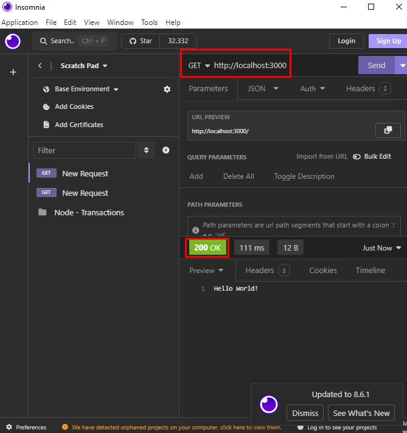

# Criando minha primeira API com Node e TS

- Inicialmente eu comecei o projeto com

``npm init -y``

- Após isso eu instalei as dependências
-- Fastify - Framework Node
``npm install fastify``

- Instalei também as dependências de desenvolvimento

-- @types/node - É necesário instalar esse pacote para o node conseguir ler o código em TS e converter em JS
``npm install -D @types/node ``

-- tsx - Automatiza o processo de converter o código TS para JS e executar o Node no JS que foi convertido e sem sujar o projeto criando o arquivo com o código convertido

``npm install tsx -D ``

Após instalar o tsx é preciso criar o script para rodar o projeto

``"dev": "tsx src/server.ts"``

